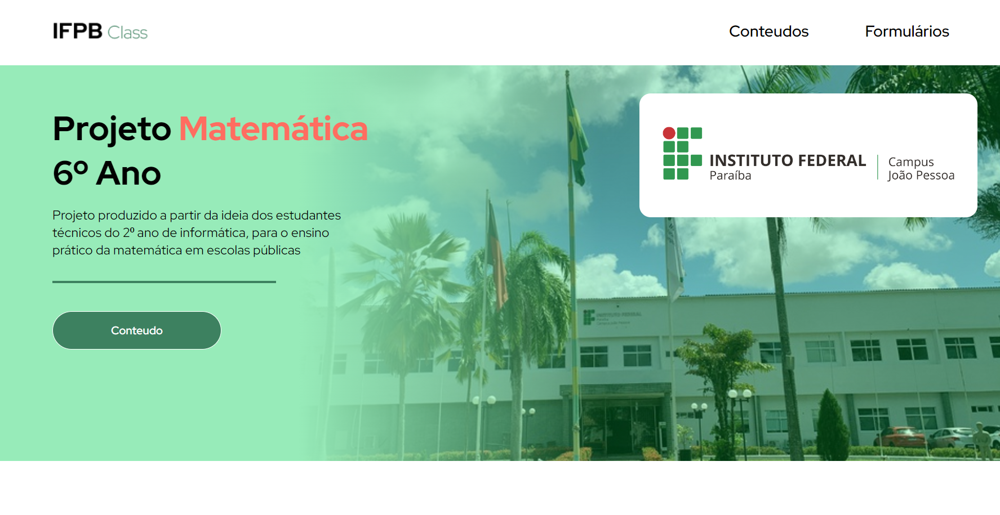

# Projeto Matematica 6 Ano

O projeto tem como finalidade compartilhar os conhecimentos produzidos pelos alunos da disciplina de Linguagens de Programação 2023, matéria do curso de Informatica do IFPB, campus João Pessoa.

## Geral

O trabalho conta com a participação da turma geral em comprometimento com o objetivo proposto.

## O que foi produzido

- conteúdos elaborados, em sua maior parte, com texto e  videos autenticos dos alunos. 

- formulários para exercitar o conhecimento proposto.

